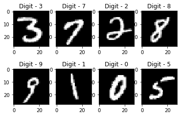

# HandWritten-Digit-Recognition-using-ML
# Handwritten Digit Recognition using Machine Learning

This project focuses on recognizing handwritten digits using machine learning techniques. The MNIST dataset is used for training and testing, and the primary tool is TensorFlow-Keras with a Sequential model.



## Table of Contents
- [Introduction](#introduction)
- [Dataset](#dataset)
- [Installation](#installation)
- [Usage](#usage)
- [Model Architecture](#model-architecture)
- [Results](#results)
- [Conclusion](#conclusion)
- [Contributors](#contributors)
- [License](#license)

## Introduction

Handwritten digit recognition is a fundamental problem in computer vision and machine learning. This project demonstrates the implementation of a digit recognition model using deep learning techniques. TensorFlow-Keras, a popular deep learning framework, is utilized to build and train a Sequential neural network for this task.

## Dataset

The project employs the MNIST dataset, which consists of 28x28 pixel grayscale images of handwritten digits (0-9). It includes a training set of 60,000 images and a test set of 10,000 images.

You can access the MNIST dataset through TensorFlow's Keras API:   

```
from tensorflow.keras.datasets import mnist
(train_images, train_labels), (test_images, test_labels) = mnist.load_data()
```

## Installations
To run this project, you need to have Python, TensorFlow, and the required libraries installed. You can install them using pip :   

```pip install tensorflow numpy matplotlib```

## Usage 
1. Clone this repository to your local machine :   
   ```git clone https://github.com/yourusername/digit-recognition.git```
2. Navigate to the project directory :   
   ```cd digit-recognition```
3. Run the Jupyter Notebook or Python script to train and evaluate the digit recognition model.
   ```jupyter notebook digit_recognition.ipynb ```


## Model Architecture
The model architecture consists of a Sequential neural network with multiple layers, including Convolutional Neural Networks (CNN) and Fully Connected layers. The model is trained using the MNIST dataset to learn to recognize handwritten digits.

Here is the summary of the model :   
```
# Define and compile the model
model = Sequential([
    Conv2D(32, (3, 3), activation='relu', input_shape=(28, 28, 1)),
    Flatten(),
    Dense(128, activation='relu'),
    Dense(10, activation='softmax')
])

model.compile(optimizer='adam',
              loss='sparse_categorical_crossentropy',
              metrics=['accuracy'])

```

## Results
The model achieved impressive results on the MNIST test dataset:

Accuracy: 90.08623%   
Precision: 0.91%    
Recall: 0.91%        
 
You can visualize the results using the provided Jupyter Notebook or script.

## Contributors 
[Akash Yadav](https://www.linkedin.com/in/akash7017/)
- Akash Yadav 
